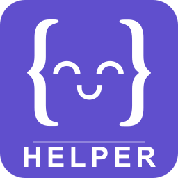

<p align="center">
  
</p>

<h1 align="center">Exercism Helper</h1>

<p align="center">
  <em>Browse, download, test, and submit Exercism exercises without leaving VS Code.</em>
</p>

<p align="center">
  <a href="https://github.com/skyswordw/vscode-exercism-helper/actions"></a>
  <a href="https://github.com/skyswordw/vscode-exercism-helper/blob/main/LICENSE"></a>
  <a href="https://github.com/skyswordw/vscode-exercism-helper/releases"></a>
  
  
  
  <a href="https://github.com/skyswordw/vscode-exercism-helper/stargazers"></a>
</p>

<p align="center">
  <a href="#features">Features</a> &middot;
  <a href="#quick-start">Quick Start</a> &middot;
  <a href="#commands">Commands</a> &middot;
  <a href="#settings">Settings</a> &middot;
  <a href="https://exercism.org">Exercism</a>
</p>

---

## Features

- **Learning Progress Sync** — Syncs your exercise status from Exercism API: completed, started, available, locked, and recommended next
- **Sidebar Tree View** — Browse all tracks and exercises with status icons in the Activity Bar
- **Exercise Instructions** — Preview READMEs with syntax-highlighted code in a Webview panel
- **One-click Test Runner** — Run `exercism test` directly from the sidebar
- **Solution Submission** — Submit solutions and auto-refresh progress
- **Download Exercises** — Browse the full exercise catalog, download with one click
- **Layout Toggle** — Swap reader/editor position (left/right) to match your preference
- **Sort Exercises** — Sort by learning path, reversed, easy-to-hard, or hard-to-easy
- **AI-friendly** — Copy instructions to clipboard or open as file for Copilot/@-referencing
- **Theme-aware UI** — Webview adapts to light, dark, and high-contrast themes

### Status Icons

| Icon | Status | Description |
|------|--------|-------------|
| ⭐ | Recommended | Next exercise in your learning path |
| ✅ | Completed | Published or completed on Exercism |
| 🔧 | In Progress | Started but not yet completed |
| ○ | Available | Unlocked and ready to start |
| 🔒 | Locked | Complete prerequisites first |

## Quick Start

1. **Install the [Exercism CLI](https://exercism.org/docs/using/solving-exercises/working-locally)** (v3.3.0+)
2. **Configure your API token:**
   ```bash
   exercism configure --token=<your-token>
   ```
   Get your token at [exercism.org/settings/api_cli](https://exercism.org/settings/api_cli)
3. **Open the Exercism sidebar** — click the Exercism icon in the Activity Bar
4. **Click Configure** if prompted, or exercises will load automatically
5. **Click any exercise** — code opens on one side, instructions on the other

## Commands

| Command | Description |
|---------|-------------|
| `Exercism: Configure` | Set up CLI token with guided flow |
| `Exercism: Download Exercise` | Browse & download from full exercise catalog |
| `Exercism: Run Tests` | Run tests for current exercise |
| `Exercism: Submit Solution` | Submit solution to Exercism |
| `Exercism: Toggle Reader Position` | Swap reader/editor layout |
| `Exercism: Toggle Sort Order` | Cycle sort: path / reversed / easy / hard |
| `Exercism: Open in Browser` | Open exercise on exercism.org |
| `Exercism: Refresh` | Clear cache and refresh exercise list |

## Settings

| Setting | Default | Description |
|---------|---------|-------------|
| `exercism.workspacePath` | `""` | Custom workspace path. Empty = auto-detect from CLI. |
| `exercism.cliPath` | `"exercism"` | Path to Exercism CLI binary. |
| `exercism.cliTimeout` | `60000` | CLI timeout in ms (min 5000). |
| `exercism.readerPosition` | `"left"` | Reader panel position: `"left"` or `"right"`. |

## Architecture

```
src/
├── cli/exercismCli.ts        # CLI wrapper + Exercism API client with caching
├── workspace/workspaceScanner.ts  # Local filesystem scanner
├── models/                   # Track, Exercise, ExerciseStatus
├── views/                    # TreeView provider + items
├── webview/                  # Markdown preview panel
└── extension.ts              # Entry point, command registration
```

## Development

```bash
# Install dependencies
npm install

# Compile
npm run compile

# Watch mode
npm run watch

# Run tests
npm test

# Launch in VS Code (F5)
# Uses .vscode/launch.json
```

## Contributing

Contributions welcome! Please open an issue first to discuss what you'd like to change.

## License

[MIT](LICENSE)

---

<p align="center">
  Built with ❤️ for the <a href="https://exercism.org">Exercism</a> community
</p>
